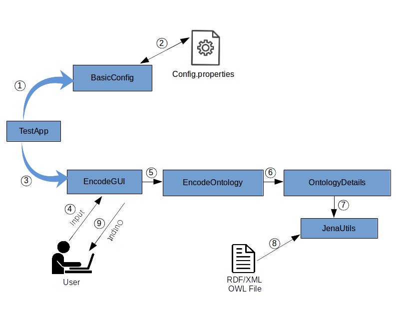

# OntEncode: A Prime Number based Ontology Encoding Mechanism.

This repository provides an implementation of a *prime number based ontology encoding technique* to enable efficient match making among the concepts of the ontology. 

# About

Due to the rapid evolution of next-generation techniques in Information Communication Technology (ICT) field, there is a choice of myriad range of applications that can be developed to address day-to-day activities. Internet of Things (IoT) as a major forerunner among these technologies provides a fundamental building block where cyber world is connected to the physical world through software services. A major thrust area in such an ecosystem is to provide services requested by the user appropriately, i.e., termed as *service discovery mechanism*. 

A service discovery technique can make use of a domain-specific ontology to effectively search for an IoT service as requested by the user. Semantic matchmaking among different services aids in calculating the similarity/dissimilarity among the services whereby they can be ranked based on user requirements. However, traditional matchmaking algorithms require heavyweight semantic knowledge that drastically increases the computational burden on the search algorithm which is further augmented by the ever-growing size of the IoT network, in terms of the number of devices and the services that they offer. 

We have implemented a *Hierarchical Prime-number based Encoding Scheme* to generate conflict-free codes for the concepts (classes, individuals, data and object properties) in the ontology. By doing so, the matchmaking technique can compare the similarity among the given services through just algebraic computations that effectively reduce the computation burden. The encoding scheme is implemented in Java and Apache Jena Framework is used to handle ontological related tasks.To extract the details of concepts and their attributes,we have constructed several SPARQL queries.These queries aid in fetching appropriate information from the ontology that is used to assign a unique code to each concept. We also provide a prototype GUI application based on Swing toolkit to demonstrate the applicability of the encoding scheme.

# Installation and Execution
 
 The following instructions are specific for Eclipse IDE, for other platforms instructions will soon be updated.

## Prerequisites

- A m2eclipse plugin compatible with Maven 3.3 or higher.
- A JDK 1.7 or higher.

## Import the Project

 - Clone or download the repository and extract. 
 - Run eclipse.
 - From the File menu, select Import.
 - Expand Maven and select Existing Maven Projects.
 - Click Next.
 - For Root Directory, click Browse and select the top-level project folder.
 - Run the project:
    - Right-click the project folder.
    - Select Run as … > Maven Build.
    - In the Goals field, enter "clean compile build".
    - Click Run.
 - A GUI will pop-up, select your inputs and click encode button to see the results.

# Architecture

The overall execution flow of the encoding scheme is as shown in the below figure:



 - The main class is *TestApp*, which controls and coordinates with the other classes. Firstly, it configures the project specific prerequisite parameters through the *BasicConfig* class.
    
- The *BasicConfig* class holds methods to read and write the configuration parameters for the input ontology file.

- Then, *EncodeGUI* is triggered by the main class to render the GUI application. 

- User can select either the in-built or external ontology file that has to be encoded. 

- Once, the input is given, *EncodeOntology* is activated that will retrieve ontology details through SPARQL queries with the help of *OntologyDetails* class. Numerous queries like list of concepts, largest in-herited chain, retrieve individuals of a given class, obtain domain/range for a given property, number of distinct classes/subclasses.

- Further, *JenaUtils* class is called upon by the OntologyDetails class. Here, OWL file is read and an in-memory Ontology model is created using Jena framework. Also, this class supports for SPARQL query execution. 

## Architectural Modules

Architectural modules are as depicted in the following:

```
├── encodeont.app       - To run the application.
|	└── TestApp  	    - Application to encode a given ontology using prime-based encoding technique.
|
├── encodeont.config    - Provides necessary classes to deal with configurations properties.
|	└── BasicConfig     - Configuration parameters of the application.
|
├── encodeont.csvutil   - Provides necessary classes to deal with csv files.
|	└── CsvUtils        - CSV utilites.Provides methods to write data to a CSV file.
|
├── encodeont.encode    - Provides necessary classes to encode the concepts of an ontology.
│   └── EncodeOntology  - Encodes a given ontology based on prime number based encoding scheme.
|
├── encodeont.guiutil   - Provides necessary classes to create the GUI tool.
│   └── EncodeGUI       - Swing based GUI for the OntEncode application.
|
├── encodeont.query     - Provides necessary classes to retrieve ontology details.
│   └── OntologyDetails - This class is used to extract information from the ontology. 
│  
├── encodeont.util      - Provides necessary classes to deal with ontology through Jena framework.
	└── JenaUtils       - Utility class to deal with the Ontology using Jena library.

```

# Further Reading

Work in progress.

# Future Works

- To perform experiments and gauge the performance of the encoding scheme with respect to several parameters like time taken, memory consumed, etc.

- To add support for different file formats for the ontology, viz., turtle, n3, etc.

- Include a few more in-built ontology file examples (like Gene Ontology, etc.).

# Acknowledgements

The project was inspired from this [paper](www.cs.kuleuven.be/publicaties/rapporten/cw/CW464.abs.html).

```
Preuveneers, Davy, and Yolande Berbers. "Prime numbers considered useful: Ontology encoding for efficient subsumption testing." Tech. Rep. CW464., Department of Computer Science, Katholieke Universiteit Leuven, Belgium,2006.
```

# Contributing

We appreciate and welcome any kind of comments and suggestions to improve the work.

# Contributors

- [Dwaraka Kulkarni](https://in.linkedin.com/in/dwaraka-kulkarni) and [Santosh Pattar](https://scholar.google.com/citations?user=DTqvAtQAAAAJ&hl=en), Department of Computer Science and Engineering, University Visvesvaraya College of Engineering, Bengaluru, India.

- [Dr. Venugopal K R](http://venugopalkr.com/), Vice Chancellor, Bangalore Univeristy, Bengaluru, India.